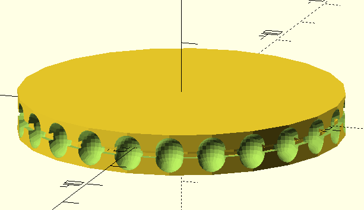

== Bead Chain Sprocket library for NopSCADlib
:openscad_lib_name: bead_chain_sprocket

Fully parametric bead chain sprocket generator.

This library depends on https://github.com/nophead/NopSCADlib[NopSCADlib] and can be used as a git submodule in NopSCADlib styled CAD projects:

[source, bash, subs=attributes+]
----
git submodule add https://github.com/eraga/{openscad_lib_name} lib/{openscad_lib_name}
----

== Example usage

[source, openscad, subs=attributes+]
----
include <../libs/{openscad_lib_name}/{openscad_lib_name}s.scad>

{openscad_lib_name}(BEAD_CHAIN_4x2x24);
----
